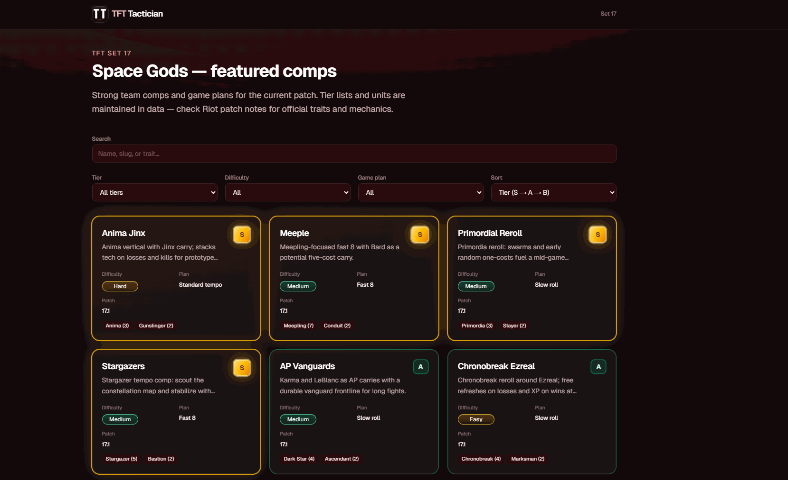

# TFT Tactician

A small **fan-made** web app for **Teamfight Tactics Set 17 (Space Gods)**. It lists featured team comps with filters (tier, difficulty, game plan), detail pages with units and items, and static champion portraits so the UI stays fast without hammering external CDNs on every page load.

**This project is not affiliated with Riot Games.** Champion names, traits, and art belong to Riot; we’re just organizing public information for practice and fun.

**Live demo:** [tft-tactician-ruddy.vercel.app](https://tft-tactician-ruddy.vercel.app/)



## Assets

Champion portrait squares are pulled from **Riot’s Data Dragon** (often called **Dragon Assets** in the community): Riot’s public CDN for versioned League art and data. Those files are mirrored into `public/champions/` for this app. Thanks to Riot for making Dragon Assets available.

- [Data Dragon — Riot Developer documentation](https://developer.riotgames.com/docs/lol#data-dragon)
- [ddragon.leagueoflegends.com](https://ddragon.leagueoflegends.com/)
- [Active Data Dragon versions (JSON)](https://ddragon.leagueoflegends.com/api/versions.json)

## Development

```bash
yarn install
yarn dev
```

Open [http://localhost:3000](http://localhost:3000). Comp data lives in `src/data/set17/comps.ts`.

```bash
yarn build
yarn lint
```

## Thanks for being here

Built with love for TFT.
If this project helped you find a comp faster or avoid a terrible pivot, that already means a lot.

If you’d like to support it, leave a star ⭐, open an issue, or send a PR.  
Thanks again — see you on the ladder.


## License

Source code in this repository is licensed under the [MIT License](https://opensource.org/licenses/MIT).

Champion portraits and related assets from Riot’s Data Dragon are © Riot Games and are used under Riot’s public developer and fan-content policies. This project is not affiliated with or endorsed by Riot Games.
